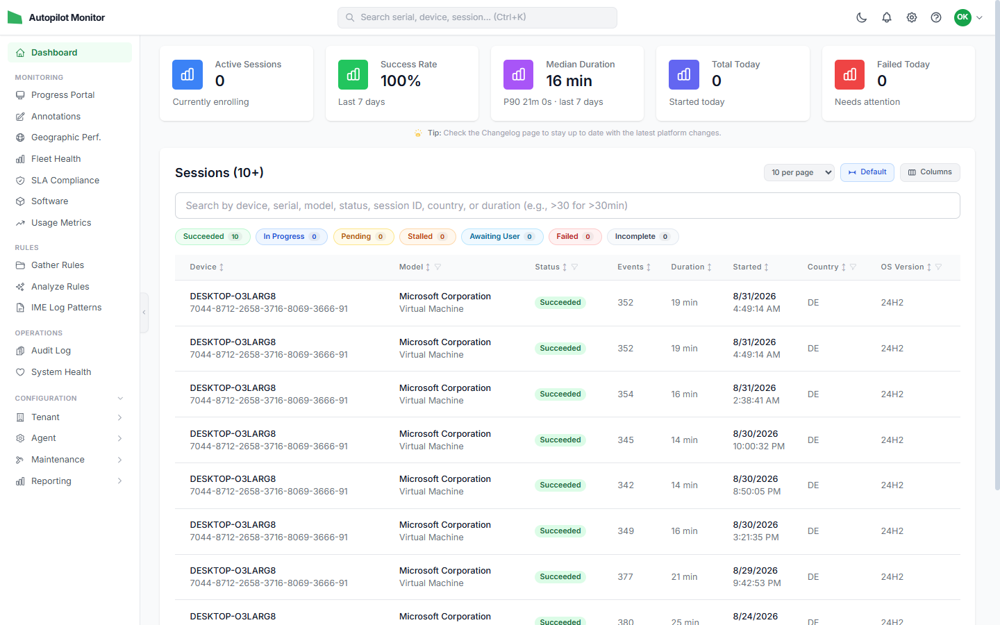
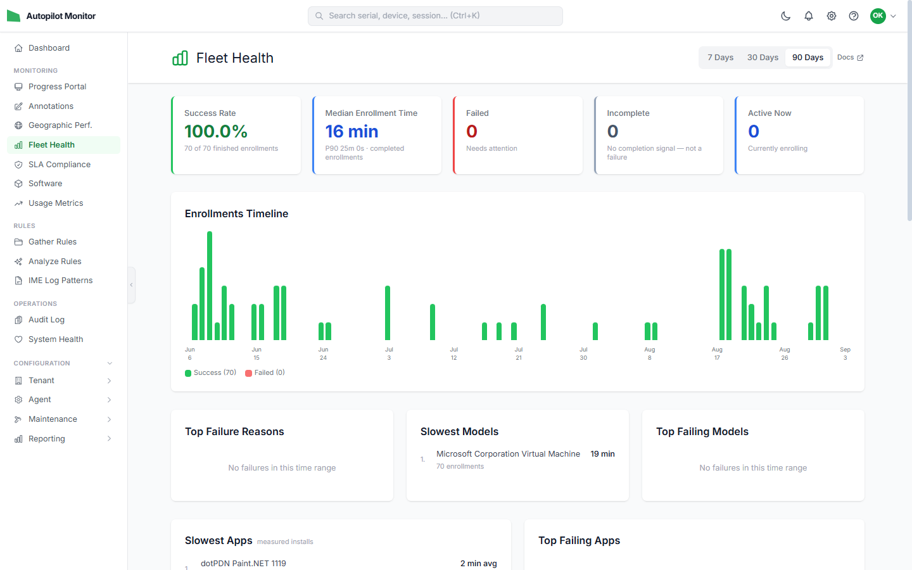
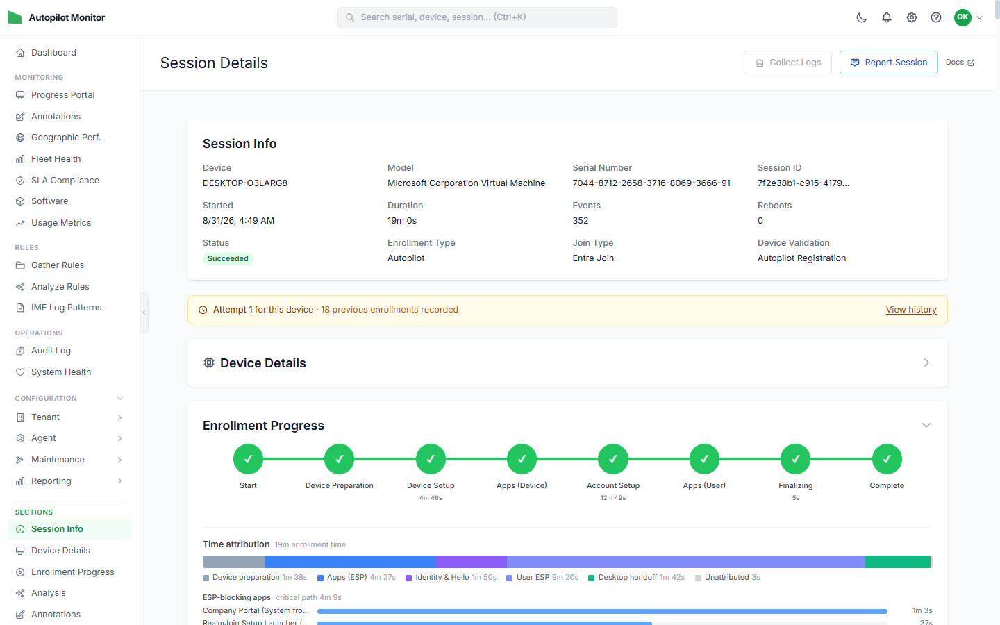
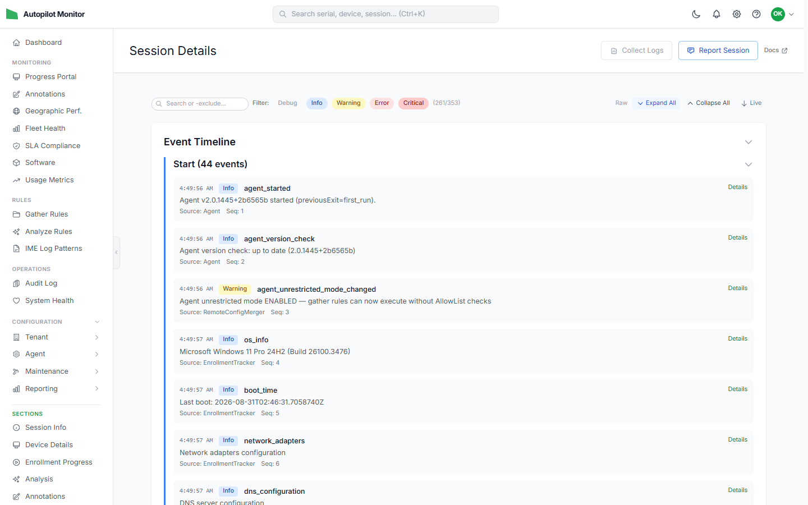

#  Autopilot Monitor

Advanced monitoring and troubleshooting solution for Windows Autopilot deployments. Gain full visibility into every enrollment session with a detailed event timeline, fleet health dashboards, and session reporting. Define custom analysis rules to automatically detect issues and gather rules to collect targeted evidence. Retrieve diagnostics packages on demand, configure agent settings like auto-reboot behavior and automatic timezone adjustment — all managed centrally from the web dashboard.

## Availability

Autopilot Monitor is **publicly available** — the Community plan is free. Sign in with your work account at **[autopilotmonitor.com](https://www.autopilotmonitor.com)**; new organizations complete a short activation step after first sign-in.

  
  

  
  

## Overview

Autopilot Monitor provides real-time tracking, intelligent diagnostics, and automated troubleshooting for Windows Autopilot enrollment processes. It consists of:

- **Bootstrap Script** — PowerShell script deployed via Intune that starts monitoring early in the enrollment process
- **Monitoring Agent** — Lightweight .NET application that collects telemetry and evidence during enrollment
- **Backend API** — Azure Functions-based ingestion and processing pipeline
- **Web Dashboard** — Next.js application for real-time monitoring and fleet analytics

## Documentation

Full admin documentation is available at **[docs.autopilotmonitor.com](https://docs.autopilotmonitor.com)**

## License

This project uses a **split licensing model**:

- **MIT License** — Agent (`src/Agent/`) and Shared library (`src/Shared/`) — unrestricted use on end-user devices
- **AGPL-3.0** — Backend (`src/Backend/`), Web Dashboard (`src/Web/`), and MCP Server (`src/McpServer/`) — server-side components remain open source

See [LICENSE](LICENSE) for full details.
